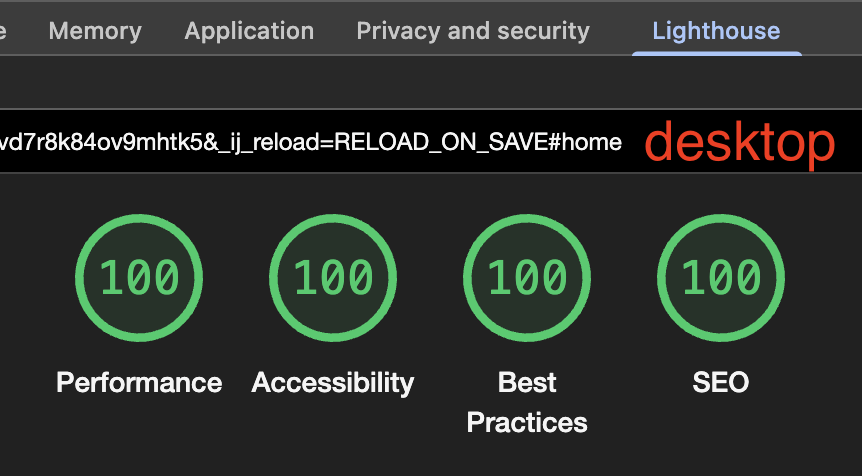
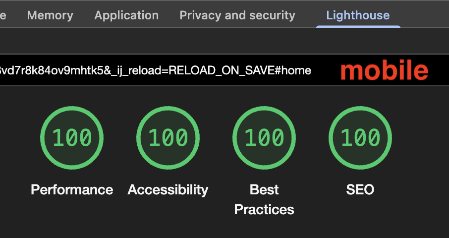

# Sophia's Hope Ranch

Website for non-profit Sophia's Hope Ranch.

# Contributing

If you would like to improve this site, please open an issue.

# Form & Mailing List Setup

The site uses two free services for its forms. Both are configured; if a key is ever removed or breaks, the forms
fail gracefully (the contact form offers a mailto fallback).

## Contact form — Web3Forms

The "Send Us a Message" form delivers submissions to `theresa@sophiashoperanch.org` via [Web3Forms](https://web3forms.com)
(free tier: 250 submissions/month). The reply-to is set to the visitor's email.

The access key lives in a hidden input in `index.html` and is public-safe to commit. The key was created under
`alex@sophiashoperanch.org`, with delivery routed to Theresa via the account's **Linked Email** setting — to change
where submissions go, update that setting in the Web3Forms dashboard rather than the code. Sending to multiple
recipients (`ccemail`) requires the Pro plan.

## Mailing list — MailerLite

The "Join Our Mailing List" form subscribes visitors via [MailerLite](https://www.mailerlite.com)
(free tier: up to 1,000 subscribers / 12,000 emails per month), which also lets you send newsletters later.

The account ID and form ID live at the top of the newsletter handler in `script.js`. They come from the embedded
form's action URL (`https://assets.mailerlite.com/jsonp/ACCOUNT_ID/forms/FORM_ID/subscribe`), and the form's email
field must stay named `fields[email]`. Double opt-in is enabled: subscribers get a confirmation email and only
appear as active after clicking it — the site's success message already tells them to check their inbox.

# Standards

This site has been tested by the Google Chrome Lighthouse plugin regarding Performance, Accessibility, Best practices,
and SEO.

All future changes will be held to the same standards.

## Desktop

## Mobile

